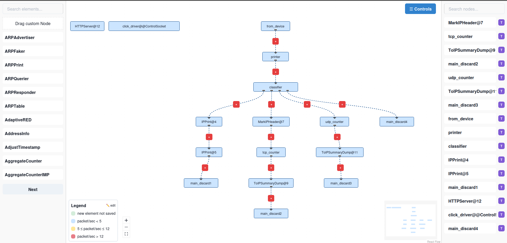

# FastClick Studio




---

## Prerequisites

To use **FastClick Studio**, you must:
- Have **FastClick** installed and running in **userlevel mode**.
- Start FastClick in **hotswapping** mode.
- **Include an `HttpServer` element** in your Click configuration to expose the API that FastClick Studio communicates with.
- Make sure FastClick is compiled with the `--enable-stats=2` option, which is required for the HTTP API to expose runtime statistics.

➡️ Documentation: [HttpServer – FastClick Wiki](https://github.com/tbarbette/fastclick/wiki/HTTPServer)

---

## Installing **FastClick**

FastClick is required. To install and configure it properly, refer to the official documentation:

**FastClick Wiki** : [FastClick GitHub Wiki](https://github.com/tbarbette/fastclick)

During development, I use the following configuration:

```sh
./configure --enable-userlevel --disable-linuxmodule --enable-user-multithread --enable-stats=2
```

### Running FastClick with HotSwapping

Once FastClick is installed, start Click in hotswapping mode with the following command:

```sh
./bin/click -R <click file> -p 7777
```

**Important** : The `-R` option is essential to enable **hotswapping**.

---

## Installing FastClick-Studio

The web interface allows you to visualize and configure FastClick elements.

### Clone the repository

```sh
git clone <URL_DU_REPO>
cd FastClick-Studio
```

### Environment Configuration

Create a `.env` file at the root of the project and add the following variables:

```sh
PORT=
```

**Note** : A `.env.example` file is available in the repository if needed.

### Installing dependencies

Install all necessary dependencies using **npm** :

```sh
npm install
```

### Start the application

```sh
npm run start
```

---

### Build the application

To build the app for production use:

```sh
npm run build
```

The output will be in the `build/` folder.

### Build into a single HTML file (inline)

You can also create a single HTML file with everything (JS and CSS inline) :

```sh
npm run build:inline
```

The result will be available in the `dist/` folder as `index.html`.

---

##  Note

- Make sure FastClick is properly configured.
